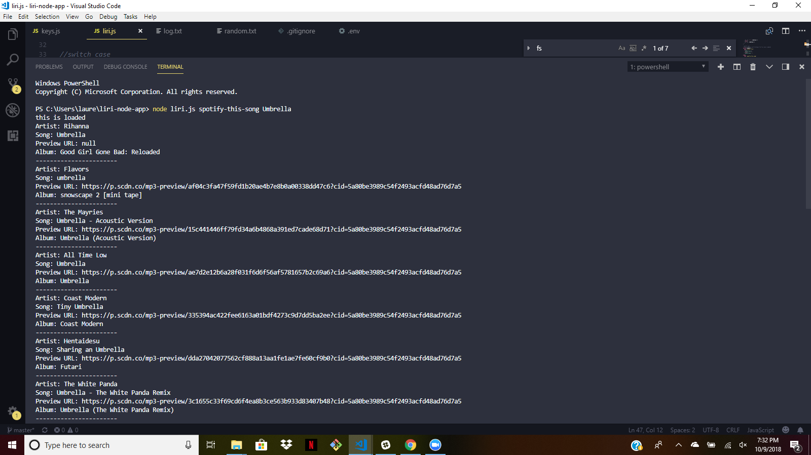
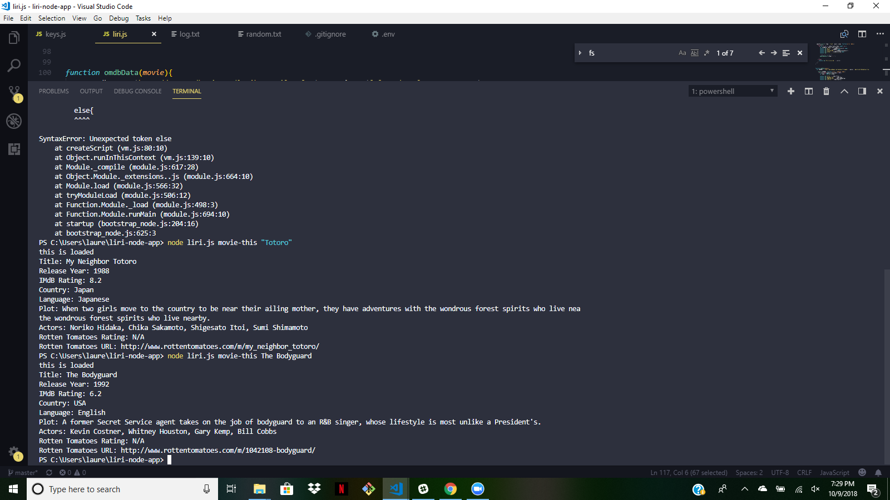
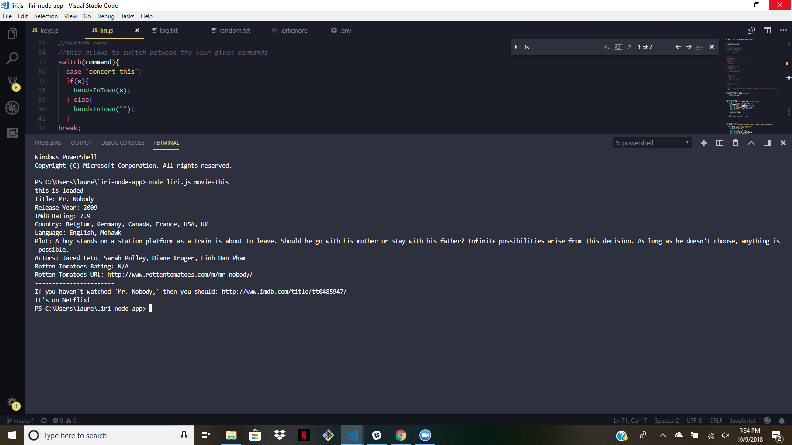
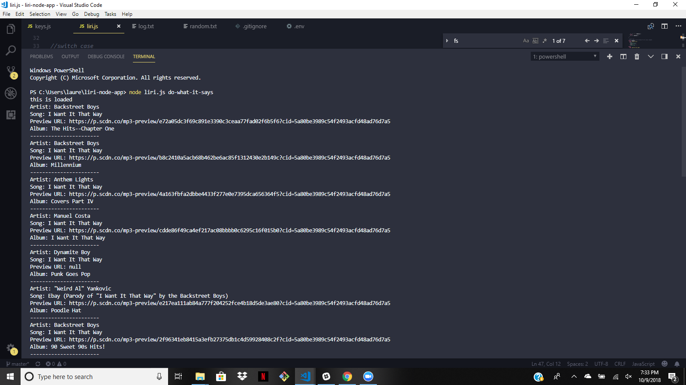
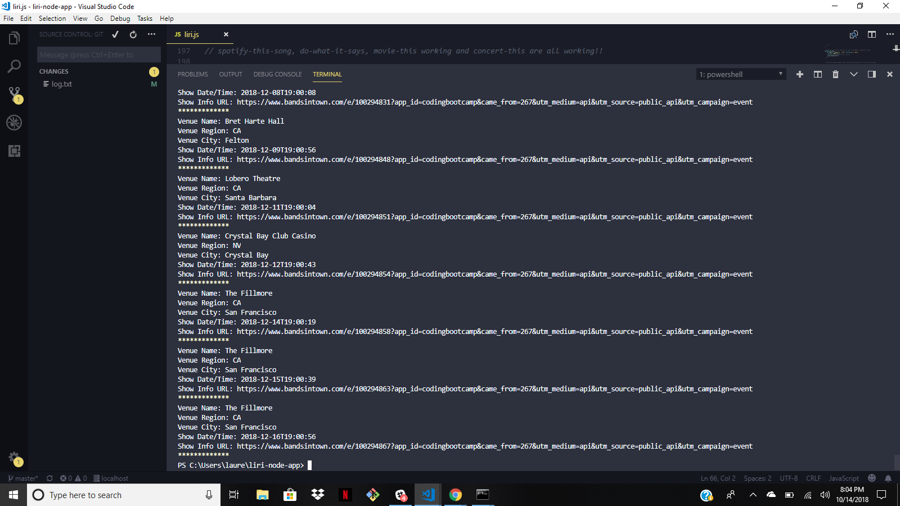

# LIRI Bot (liri-node-app)

LIRI is a Language Interpretation and Recognition Interface. LIRI is a command line node app that takes in parameters and gives you back data.

LIRI uses the following NPM Packages:

- <a href="http://www.npmjs.com/package/mhs-bandsintown" rel="link">Bands in Town</a>
- <a href="https://www.npmjs.com/package/spotify" rel="link">Spotify API</a>
- <a href="https://www.npmjs.com/package/request" rel="nofollow">Request</a>
- <a href="https://www.npmjs.com/package/moment" rel="link"> Moment</a>
- <a href="https://www.npmjs.com/package/dotenv" rel="link">DOTENV</a>

### To See My App in Action
- You would need valid user id's and keys for the Bands in Town API, Spotify and OMDB. Also a keys.js file to store them in.
- Clone This Repo on local computer and have node.js installed also
- Use command "npm i spotify", "npm i moment" "npm i request" "npm i dotenv" in your preferred command line terminal
- Use command "node liri.js" and one of the given commands below
- Watch the Magic!

  
### LIRI Commands
In the command line, you would type: node liri.js and any of the four following commands:
- concert-this 'artist/band name here'
- spotify-this-song <song name here>
- movie-this <movie name here>
- do-what-it-says
  
  ### What Each Command Should Do
1. `node liri.js concert-this <artist/band name here>`

	* This will search the Bands in Town API for an artist and returns: 
		* Name of Venue
		* Venue Region
		* Venue City
		* Show Time/Date
		* Show Info URL

2. `node liri.js spotify-this-song '<song name here>'`

	* This will show the following information about the song in your terminal/bash window
		* Artist(s)
		* The song's name
		* A preview link of the song from Spotify
		* The album that the song is from

	* If no song is provided then your program will default to:
		* "The Sign" by Ace of Base

3. `node liri.js movie-this '<movie name here>'`

	* This will output the following information to your terminal/bash window:

		* Title of the movie.
		* Year the movie came out.
		* IMDB Rating of the movie.
		* Rotten Tomatoes Rating.
		* Country where the movie was produced.
		* Language of the movie.
		* Plot of the movie.
		* Actors in the movie.
		

	* If the user doesn't type a movie in, the program will output data for the movie 'Mr. Nobody.'
		* If you haven't watched "Mr. Nobody," then you should: http://www.imdb.com/title/tt0485947/
		* It's on Netflix!

4. `node liri.js do-what-it-says`
	* Using the `fs` Node package, LIRI will take the text inside of random.txt and then use it to call one of LIRI's commands.
		* It should run `spotify-this-song` for "I Want it That Way," as follows the text in `random.txt`.
		
### Screenshots of Code (Working Examples)

* Example for spotify-this-song 'Umbrella' 

* Example for spotify-this-song with no text added 

* Example for movie-this 

* Example for movie-this with no text entered 

* Example for do-what-it says 

* Example of concert-this 

### Link to Video Walkthrough of Liri Bot
https://drive.google.com/file/d/1syUt3NLu5kxhc3RKt88CrbEygJ5e6ksz/view

### Copyright
Lauren Santosuosso. Copyright 2018. All Rights Reserved.
<a href="https://github.com/LaurenSantos23">Lauren Santosuosso/Github</a>
	
 
  
    
